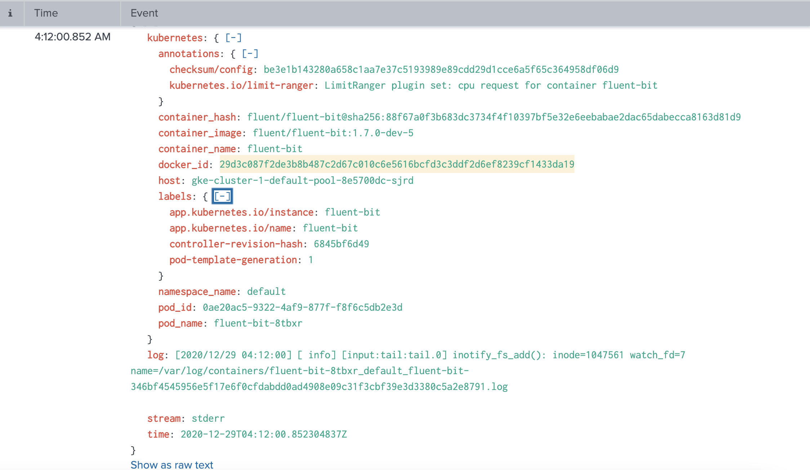

> Get started deploying Fluent Bit on top of Kubernetes in 5 minutes, with a walkthrough using the helm chart and sending data to Splunk. 

In this guide, we will walk through deploying Fluent Bit into Kubernetes and writing logs into Splunk. For this blog, I will use an existing Kubernetes and Splunk environment to make steps simple. You can also see an architecture diagram below:

{:class="img-responsive"}


## Getting Fluent Bit configuration ready
If you are not familiar with Fluent Bit, it is an open-source application written in C to help ship data from many sources to many destinations. Fluent Bit is exceptionally lightweight, performant, and resilient - which makes it ideal for Kubernetes environments.

To send data to Splunk, we will need to define an output within Fluent Bit configuration. I'll mask the host and Splunk_token parameters and use `tls.verify` to allow us to skip adding the certificate for now.

```
[OUTPUT]
    Name splunk
    Match *
    Host XXXXXXXXXX
    Port 8088
    Splunk_Token xxxxxxxxxxxxxxxxxxx
    tls On
    tls.verify Off
```

## Deploying via Helm
The simplest way to take this configuration and put it into action is by grabbing the Helm charts from the Fluent repository: https://github.com/fluent/helm-charts/. If you are not familiar with Helm - you can think of it as one of the package managers for Kubernetes, similar to rpm/deb on Linux.

Clone this repo into your workspace. Let's take a look at the structure of the fluent bit chart.

```
├── Chart.yaml
├── README.md
├── templates
│   ├── NOTES.txt
│   ├── _helpers.tpl
│   ├── _pod.tpl
│   ├── clusterrole.yaml
│   ├── clusterrolebinding.yaml
│   ├── configmap.yaml
│   ├── daemonset.yaml
│   ├── deployment.yaml
│   ├── psp.yaml
│   ├── service.yaml
│   ├── serviceaccount.yaml
│   ├── servicemonitor.yaml
│   └── tests
│       └── test-connection.yaml
└── values.yaml
```

Let's modify value.yaml, delete the configured outputs for ES, and insert our configuration from Step 1:

```
  ## https://docs.fluentbit.io/manual/pipeline/outputs
  outputs: |
      [OUTPUT]
        Name splunk
        Match *
        Host XXXXXXXXXX
        Port 8088
        Splunk_Token xxxxxxxxxxxxxxxxxxx
        tls On
       tls.verify Off
```

With the values.yml saved, and the only output for Splunk configured, we will change into the fluent-bit chart directory and deploy via the following command:

```
helm install fluent-bit .
```
This gives the name `fluent-bit` to the helm chart. We should receive the following acknowledgment, and we should be good to go.
```
NAME: fluent-bit
LAST DEPLOYED: Mon Dec 28 11:22:51 2020
NAMESPACE: default
STATUS: deployed
REVISION: 1
NOTES:
Get Fluent Bit build information by running these commands:

export POD_NAME=$(kubectl get pods --namespace default -l "app.kubernetes.io/name=fluent-bit,app.kubernetes.io/instance=fluent-bit" -o jsonpath="{.items[0].metadata.name}")
echo "curl http://127.0.0.1:2020 for Fluent Bit build information"
kubectl --namespace default port-forward $POD_NAME 2020:2020
```

Let's check Splunk for incoming logs.
{:class="img-responsive"}

## What happening?
The helm chart deploys Fluent Bit as a DaemonSet within the Kubernetes environment, along with proper service accounts and configuration. DaemonSet deployments ensure that every node of Kubernetes will have a Fluent Bit instance running alongside it, capturing all the logs generated from Kubernetes pods.

The remaining configuration in value.yaml also specifies a `filter` plugin that gives fluent-bit the ability to talk to the Kubernetes API server enriching each message with context about what pod/namespace / k8s node the application is running on.

## Conclusion
Logging in Kubernetes is a must as you start to add more and more applications. Thankfully, deploying Fluent Bit is simple thanks to the helm chart's and Fluent Bit's lightweight, performant, and resilient package.

If you have any questions, join us in the fluent slack channel (https://slack.fluentd.org).
